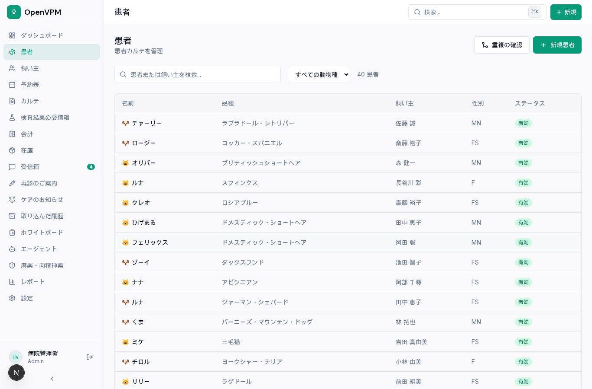

# OpenVPM 日本語版（非公式）— 動物病院の電子カルテ・予約・会計

[OpenVPM](https://github.com/evangauer/openvpm) は、動物病院のための電子カルテ・予約・会計・在庫の管理システムです（オープンソース・AGPLv3）。
このリポジトリは、それを日本の動物病院で使えるように日本語化したフォークです。

> **非公式です。** 本家 OpenVPM および開発元とは提携していません。日本語化は株式会社エクスブリッジが独自に行っています。
> 本家への貢献: [evangauer/openvpm#343](https://github.com/evangauer/openvpm/pull/343)（医院の国に日本を追加）

English: [README.en.md](README.en.md)


## 日本語版でできること

- **画面の日本語化**: メニュー・見出し・表・ボタン・入力欄・通知・状態表示など約3,800の文言。
  用語は動物病院の言い方にそろえています（患者・飼い主・カルテ・会計・麻薬・向精神薬・再診のご案内 など）。
- **日本の地域設定**: 医院の国に「日本」。円（¥）・消費税10%・東京時間・日付は 2026/09/29 の形。
- **名前の順番**: 飼い主やスタッフの名前を「姓 名」の順で表示・検索します。
- **紙カルテからの移行**: 表計算ソフトに打ち込んだ飼い主・患者・ワクチン歴・診療記録を、そのまま CSV で取り込めます。
  日本語の列名（姓・名・動物名・動物種・性別・生年月日・接種日・来院日 など）、
  日本語の値（犬・猫・ウサギ・去勢オス・避妊メス など）、
  日付の書き方（2019/3/5・2019年3月5日・令和元年5月1日・R5.3.5・全角数字）に対応しています。
  取り込みは本家の仕組みのまま「試し実行 → 確認 → 本番」の順で、重複は自動で飛ばします。
- **日本語のデモデータ**: 架空の「なごみ動物病院」（スタッフ8人・飼い主25人・患者40頭・2週間分の予約・請求・在庫50品目）。

| 患者 | 会計 |
|---|---|
|  |  |

## 手元で動かす

必要なもの: Node.js 20 以上・pnpm 9 以上・Docker

```bash
git clone https://github.com/katsushi2441/openvpm-jp.git
cd openvpm-jp
cp .env.example .env
# .env に次の1行を足すと画面が日本語になります
echo 'NEXT_PUBLIC_OPENVPM_LANGUAGE=ja' >> .env

# データベースとファイル置き場（下の「MinIO について」も参照）
docker compose -f docker/docker-compose.yml -f docker/docker-compose.jp-local.yml up -d postgres minio minio-bootstrap
# docker-compose.jp-local.yml はデータベースを 127.0.0.1:55441、ファイル置き場を 127.0.0.1:55442 に出します。
# .env の DATABASE_URL と S3_ENDPOINT をこの番号に合わせてください。

pnpm install --frozen-lockfile
pnpm db:migrate
OPENPIMS_APP_DB_PASSWORD='local-openpims-app' pnpm db:rls
pnpm db:seed:ja        # 日本語のデモデータ（英語のデモは pnpm db:seed）
pnpm dev
```

`http://localhost:3000` を開き、`admin@neighborhoodvet.example.com` / `password123` でログインします。

### MinIO について

本家の Docker 構成はファイル置き場に MinIO を使いますが、MinIO は公式の Docker イメージの無償配布をやめたため、
`minio/minio`・`minio/mc` を取得できません（2026年9月に確認）。
`docker/docker-compose.jp-local.yml` は、S3 互換の [SeaweedFS](https://github.com/seaweedfs/seaweedfs) に差し替えています。

## 日本語化の仕組み

- `apps/web/lib/i18n/` … 翻訳関数 `tx()`。英語の文言そのものを鍵にし、訳が無ければ英語のまま表示します（本家の方針 `docs/I18N.md` どおり）。
  言語は環境変数 `NEXT_PUBLIC_OPENVPM_LANGUAGE`（`ja` / 既定 `en`）で切り替えます。
- `apps/web/lib/i18n/messages/ja.json` … 日本語の訳。
- `jp/scripts/wrap-strings.mjs` … 画面の直書きの文言を `tx()` で包む変換（本家の更新を取り込むたびに再実行します）。
- `jp/scripts/translate.py` … 未訳の文言を訳す（ローカルの LLM を使用）。

## まだ英語のままのもの

- 飼い主へのメール・SMS・PDF（同意書など）の文面
- AI エージェントの応答
- 数字や名前の前後に入る文の一部は、語順が不自然な所があります

## 導入の支援

本番で使うための手順（サーバーの用意・バックアップ・紙カルテの移行表のひな形・スタッフの初期設定）をまとめた
「動物病院の電子カルテ OpenVPM 日本語版 導入キット」を、[株式会社エクスブリッジ](https://exbridge.jp/) で用意しています。

## ライセンス

GNU AGPLv3（本家と同じ）。改変したものをネットワーク越しに提供する場合は、利用者にソースコードを公開する必要があります。
